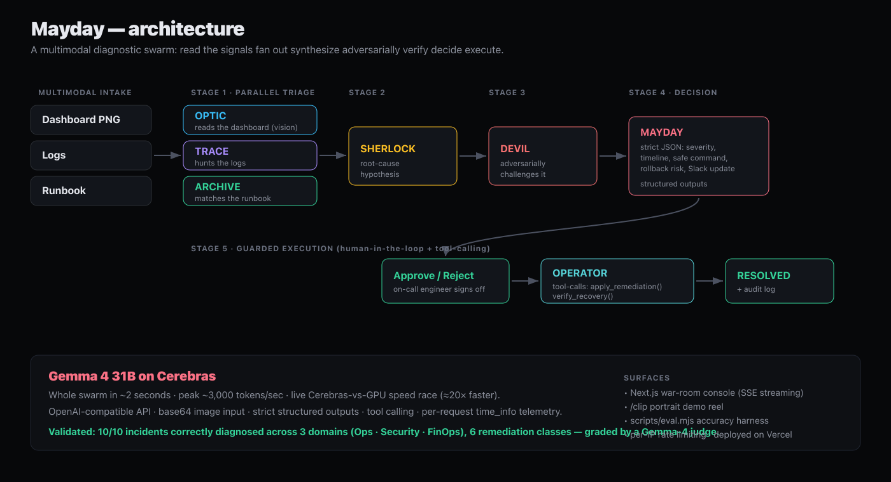

# 🚨 Mayday — AI Incident Commander

**A swarm of 6 Gemma 4 31B agents triages your production incident in seconds — running on Cerebras.**

Built for the **Cerebras × Google DeepMind Gemma 4 24-Hour Hackathon**. Mayday turns an alert — a dashboard screenshot, raw logs, and a runbook — into a root-cause diagnosis, a safe remediation command, and a ready-to-paste Slack update. The whole investigation finishes in **~2.5 seconds** because every agent runs on Cerebras at **1,000–2,400 tokens/sec**.

> Multimodal · multi-agent · speed-native. Targets **Track 1** (multi-agent + multimodal), **Track 3** (enterprise / incident response), and **Track 2** (People's Choice).

---

## The swarm

| Stage | Agent | Codename | Does |
|------|-------|----------|------|
| 1 ‖ parallel | 👁️ Vision Analyst | **OPTIC** | Reads the alert dashboard **screenshot** (multimodal) |
| 1 ‖ parallel | 📜 Log Analyst | **TRACE** | Finds the smoking gun in the logs |
| 1 ‖ parallel | 📚 Runbook Retriever | **ARCHIVE** | Matches the relevant runbook section (and rejects distractors) |
| 2 | 🧠 Root-Cause Analyst | **SHERLOCK** | Synthesizes a leading hypothesis with a causal chain |
| 3 | 🛡️ Skeptic | **DEVIL** | **Adversarially challenges** the hypothesis before it's trusted |
| 4 | 📣 Incident Commander | **MAYDAY** | Issues the final **structured** decision: severity, timeline, safe command, Slack update |

Stage 1 fans out **in parallel** — the moment Cerebras speed compounds. Then SHERLOCK → DEVIL → MAYDAY run in sequence. Everything streams live to the UI.

## Why Cerebras + Gemma 4

- **Multimodal**: OPTIC reads a real Grafana-style dashboard via Gemma 4's `image_url` (base64) input.
- **Structured outputs**: MAYDAY emits a strict-JSON decision (`response_format: json_schema, strict`).
- **`time_info`**: every response carries real timing — we surface live **tokens/sec** + **TTFT**.
- **Speed race**: a built-in side-by-side running the **same model** — Gemma 4 31B on Cerebras vs the same model on a reputable **full-precision (bf16) GPU** provider (W&B Inference via OpenRouter, pinned for a fair + reproducible comparison; not an AI-chip competitor), measured identically on both lanes — typically **~20–40× faster** on output throughput.

## Proof — it generalizes



Mayday is validated on **10 real-world incidents across 3 domains**, each with its own dashboard, logs, runbook, and hand-written ground truth:

- **Ops / SRE (6):** DB connection-pool exhaustion, Redis cache stampede, a memory-leak OOM storm, a bad feature-flag rollout, a downstream / 3rd-party outage, and a metastable retry storm.
- **Security / SOC (2):** distributed credential stuffing and data exfiltration via a compromised credential.
- **FinOps / Cost (2):** an over-provisioned ASG after a bad Terraform apply, and an orphaned idle GPU cluster.

The *same* 6-agent swarm handles all of them — and picks the **right class of fix each time** across six remediation classes (rollback · disable-the-flag · fail-over · shed-load · contain · cost-fix), which is the test of real reasoning rather than pattern-matching. `scripts/eval.mjs` runs every incident end-to-end through the live swarm and grades the diagnosis with a Gemma-4 judge:

> **10 / 10 correctly diagnosed · avg ~2.3s per incident · peak ~3,000 tok/s.** → [docs/EVAL.md](docs/EVAL.md)

## Run it

```bash
npm install
cp .env.example .env.local      # then paste your CEREBRAS_API_KEY (csk-...)
npm run dev
```

Open the app, click **load sample**, then **🚨 DISPATCH SWARM**. Or drop your own Grafana/Datadog screenshot + logs + runbook.

### Environment

| Var | Required | Notes |
|-----|----------|-------|
| `CEREBRAS_API_KEY` | ✅ | From [cloud.cerebras.ai](https://cloud.cerebras.ai). Model is `gemma-4-31b`. |
| `BASELINE_API_KEY` / `BASELINE_BASE_URL` / `BASELINE_MODEL` / `BASELINE_LABEL` | optional | A real GPU provider for the speed race. Without it, a clearly-labeled representative baseline is shown. |

### Scripts

```bash
node --env-file=.env.local scripts/test-cerebras.mjs   # smoke-test the API (chat, streaming, image, structured)
node --env-file=.env.local scripts/eval.mjs <baseUrl>  # run the 7-incident accuracy eval -> docs/EVAL.md
node scripts/gen-dashboards.mjs                         # regenerate all scenario dashboard PNGs
npm run build                                           # production build
```

## Architecture

```
app/
  page.tsx                  server entry → <Console/>
  api/incident/route.ts     SSE: runs the swarm, streams every token
  api/race/route.ts         SSE: Cerebras vs GPU speed race
  api/{config,scenario}     UI bootstrap
lib/
  cerebras.ts               OpenAI client → Cerebras; streamAgent + runCommander (structured)
  orchestrator.ts           the 4-stage fan-out, emits StreamEvents
  agents.ts / roster.ts     system prompts (server) + roster metadata (client)
  race.ts                   speed-race runner
  data/                     agent-prompts.json · scenario.json
components/                 Console, AgentCard, SpeedHud, CommanderPanel, SpeedRace
scripts/gen-dashboard.mjs   builds the Grafana-style sample dashboard
docs/                       DEMO_SCRIPT.md · SOCIAL.md · SUBMISSION.md
```

## Demo & submission

See [`docs/DEMO_SCRIPT.md`](docs/DEMO_SCRIPT.md) (60-second video), [`docs/SOCIAL.md`](docs/SOCIAL.md) (X launch thread), and [`docs/SUBMISSION.md`](docs/SUBMISSION.md) (full writeup).

---

*Built on Gemma 4 31B running on Cerebras. `#Gemma4`*
